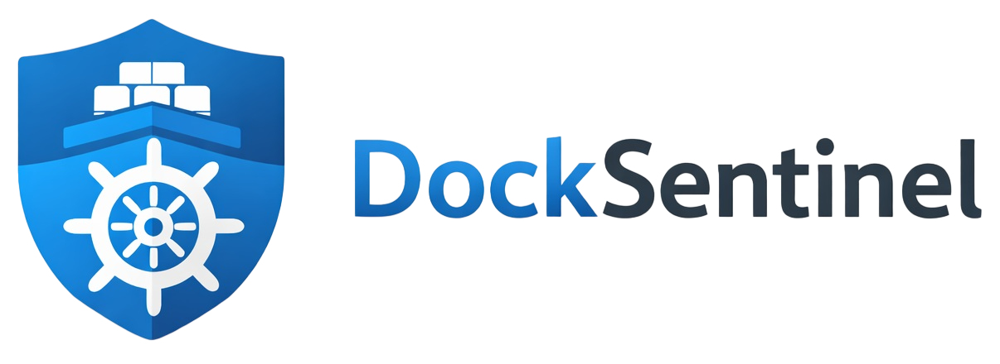

# DockSentinel

<p align="center">
  
</p>

<p align="center">
  <strong>Monitoramento e atualizacao inteligente de containers Docker</strong> 🐳🛡️
</p>

## O que e o DockSentinel?

O **DockSentinel** e uma aplicacao para **monitorar atualizacoes de containers Docker** e executar atualizacoes com seguranca, controle e rastreabilidade.

Ele nasceu para resolver um problema comum em ambientes self-hosted e homelab:

- saber **quais containers tem update disponivel**;
- decidir **quando** e **como** atualizar;
- evitar atualizacoes cegas e sem visibilidade;
- manter o ambiente protegido com autenticacao configuravel.

## Status atual

O projeto ja possui a **base MVP pronta** ✅, com foco em operacao real:

- listagem de containers;
- checagem manual e automatica de updates;
- enfileiramento de atualizacoes;
- execucao individual e em lote;
- scheduler com configuracoes avancadas;
- autenticacao com multiplos modos de seguranca.

## Recursos principais (MVP)

### 1) Visao de containers (Dashboard) 📦

- lista containers do host Docker;
- mostra estado/status;
- exibe detalhes tecnicos do container;
- permite selecionar varios containers.

### 2) Checagem de atualizacoes 🔎

- checagem **individual** por container;
- checagem **em massa** ("Checar todos");
- comparacao por digest (local x remoto) para detectar update real.

### 3) Atualizacao individual e em lote ⚙️

- atualizar um container especifico;
- atualizar containers selecionados em lote;
- bloqueio por label para evitar update indevido (`docksentinel.update=false`).

### 4) Fila de atualizacoes (Jobs) 🧵

- enfileira jobs de update;
- processamento assicrono por worker;
- historico/observabilidade com status:
  - queued
  - running
  - success/done
  - failed

### 5) Scan manual e automatico 🤖

- scan manual sob demanda:
  - `scan_only`
  - `scan_and_update`
- scheduler com cron configuravel;
- modo e escopo configuraveis:
  - `scan_only` ou `scan_and_update`
  - `all` ou `labeled`
- filtros por labels de scan/update.

### 6) Configuracoes amplas de atualizacao 🛠️

- habilitar/desabilitar scheduler;
- cron expression customizavel;
- escolha de modo de execucao;
- escolha de escopo de containers;
- chaves de label configuraveis (`scanLabelKey`, `updateLabelKey`);
- status de runtime do scheduler (proxima execucao, ultimo erro, ultimo resultado).

### 7) Alta seguranca e autenticacao flexivel 🔐

Modos suportados:

- `none` (sem senha)
- `password` (somente senha)
- `totp` (somente TOTP)
- `both` (senha + TOTP)

Mais recursos de seguranca:

- sessao por cookie assinado (`HttpOnly`);
- hash de senha com Argon2;
- secret TOTP criptografado;
- guard global de autenticacao.

## Arquitetura (resumo)

- **Frontend:** React + Vite (`apps/docksentinel-web`)
- **Backend:** NestJS (`apps/api`)
- **Banco:** SQLite + Prisma
- **Execucao Docker:** integracao via Docker socket
- **Deploy/Release:** scripts de release + GitHub Actions + Docker Hub

## Estrutura do repositorio

```text
apps/
  api/               # Backend NestJS (docker, updates, auth, settings)
  docksentinel-web/  # Frontend React (dashboard, jobs, scheduler, settings)
scripts/             # Automacao de release/publicacao
.github/workflows/   # CI/CD e publicacao Docker
Docs/                # Documentacao operacional e de releases
```

## Documentacao complementar

- Manual de scripts e workflows: `Docs/Manual-Scripts-e-Workflows.md`
- Guia de releases/CI-CD: `Docs/Releases.md`

## Visao de produto

O DockSentinel busca ser um **"control plane leve para updates Docker"**:

- simples de operar no dia a dia;
- robusto para ambientes reais;
- seguro por padrao;
- extensivel para melhorias futuras.

---

Feito para quem quer menos atualizacao manual e mais confiabilidade no ciclo de vida dos containers. 🚀
