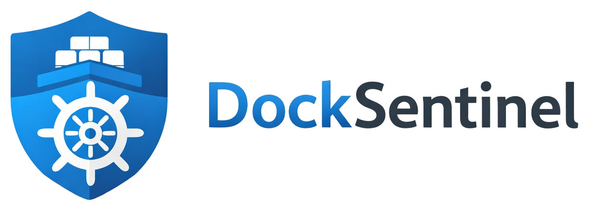

# DockSentinel

<p align="center">
  
</p>

<p align="center">
  <strong>Monitoramento e atualizacao inteligente de containers Docker</strong>
</p>

## O que e o DockSentinel?

DockSentinel e um painel web para monitorar updates de containers Docker e executar atualizacoes com controle, seguranca e rastreabilidade.

Ele foi pensado para ambientes self-hosted e homelab onde voce precisa:

- identificar quais containers possuem nova imagem;
- decidir quando atualizar;
- executar atualizacao individual ou em lote;
- acompanhar fila e historico de jobs.

## Instalacao com Docker Compose (Docker Hub)

### Imagens disponiveis

- `docker pull leufrasiojunior/docksentinel:latest`
- `docker pull leufrasiojunior/docksentinel:beta`
- `docker pull leufrasiojunior/docksentinel-agent:latest`
- `docker pull leufrasiojunior/docksentinel-agent:beta`

### 1. Crie o `docker-compose.yml`

```yaml
services:
  docksentinel:
    image: leufrasiojunior/docksentinel:latest
    # image: leufrasiojunior/docksentinel:beta
    container_name: docksentinel
    restart: unless-stopped
    ports:
      - "8080:80"
      - "3000:3000"
    environment:
      PORT: "3000"
      LOG_LEVEL: "info"
      DATABASE_URL: "file:/data/docksentinel.db"
      DOCKSENTINEL_SECRET: "CHANGE_ME_CHANGE_ME_CHANGE_ME_32CHARS_MIN"
      AUTO_MIGRATE: "true"
      SWAGGER_ENABLED: "true"
      CORS_ORIGINS: "*"
      TZ: "America/Sao_Paulo"
    volumes:
      - docksentinel_data:/data
      - /var/run/docker.sock:/var/run/docker.sock

volumes:
  docksentinel_data:
```

### 2. Suba o DockSentinel

Versao `latest` (padrao):

```bash
docker compose pull
docker compose up -d
```

Versao `beta`:

```bash
DOCKSENTINEL_TAG=beta docker compose pull
DOCKSENTINEL_TAG=beta docker compose up -d
```

### 3. Acesse a aplicacao

- UI: `http://localhost:8080`
- API docs (opcional): `http://localhost:3000/docs`

## Como usar

Depois de subir o container:

1. Acesse `http://localhost:8080`.
2. Abra a tela `Environments` para entrar no ambiente `Local` ou cadastrar remotos.
3. Rode a checagem de updates (manual ou automatica).
4. Atualize containers individualmente ou em lote.
5. Ajuste modo de autenticacao e scheduler em Settings.

Se `SWAGGER_ENABLED=true`, a API fica disponivel em `http://localhost:3000/docs`.

## Environments remotos com DockSentinel Agent

O DockSentinel agora suporta environments no estilo Portainer. O ambiente `local` continua embutido, e cada host remoto usa um `docksentinel-agent` separado.

Fluxo resumido:

1. Abra `Environments` no DockSentinel principal.
2. Crie um environment remoto.
3. Copie o comando `docker run` exibido pela UI.
4. Execute esse comando no host remoto.
5. Volte ao DockSentinel principal e teste a conexao.

### Exemplo de instalacao manual do agente

```bash
docker run -d \
  --name docksentinel-agent \
  --restart unless-stopped \
  -p 45873:45873 \
  -e PORT=45873 \
  -e DOCKSENTINEL_AGENT_TOKEN='SEU_TOKEN_AQUI' \
  -v /var/run/docker.sock:/var/run/docker.sock \
  leufrasiojunior/docksentinel-agent:latest
```

### Exemplo com Docker Compose

```yaml
services:
  docksentinel-agent:
    image: leufrasiojunior/docksentinel-agent:latest
    container_name: docksentinel-agent
    restart: unless-stopped
    ports:
      - "45873:45873"
    environment:
      PORT: "45873"
      DOCKSENTINEL_AGENT_TOKEN: "SEU_TOKEN_AQUI"
      TZ: "America/Sao_Paulo"
    volumes:
      - /var/run/docker.sock:/var/run/docker.sock
```

Mais detalhes em [`dock_agent/README.md`](dock_agent/README.md).

## Atualizacao da aplicacao

Para atualizar a imagem e recriar o container:

```bash
docker compose pull
docker compose up -d
```

## Observacoes importantes

- Troque `DOCKSENTINEL_SECRET` por um valor forte (minimo 32 caracteres). Para gerar automaticamente, voce pode usar: `https://www.random.org/passwords/`.
- O mount `/var/run/docker.sock` e obrigatorio para o DockSentinel inspecionar e atualizar containers do host.
- O banco SQLite fica persistido no volume `docksentinel_data`.
- A porta padrao do agente e `45873`.
- O `docksentinel-agent` nao deve ser instalado no mesmo host onde o DockSentinel principal ja esta rodando. Se isso acontecer, o agente registra o erro nos logs e encerra com `exit 1`.
